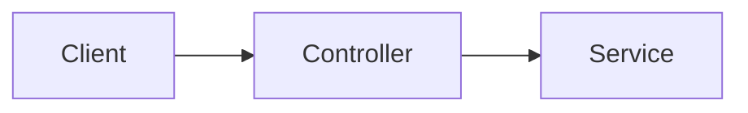

# Title of the reference

<!-- reference-table:start -->
<!-- reference-table:end -->

Explain how this part of the system works, for a reader — human or agent — who
has not seen the code. Describe behaviour and structure as they are today; keep
this current as the code changes. This is documentation, not an ADR: no decision
record, status, or consequences.

Mermaid diagrams are supported and render on GitHub:

